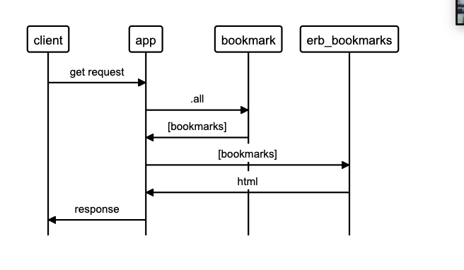

# Bookmark Manager

## User Stories

```
As a internet user,
So that I can see the pages I've bookmarked, 
I'd like to view my bookmarks. 
```

## Domain Model

| Objects                     | Messages          |
| --------------------------- | ----------------- |
| User                        |                   |
| Bookmark                    |                   |
| Bookmarks                   | view_bookmarks    |




## Instructions for running database

- Connect to psql
- Create the database using the psql command CREATE DATABASE bookmark_manager;
- Connect to the database using the pqsl command \c bookmark_manager;
- Run the query we have saved in the file 01_create_bookmarks_table.sql